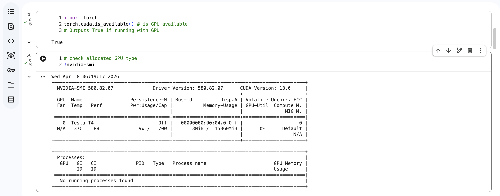
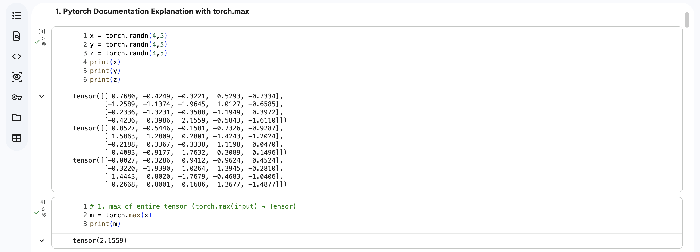
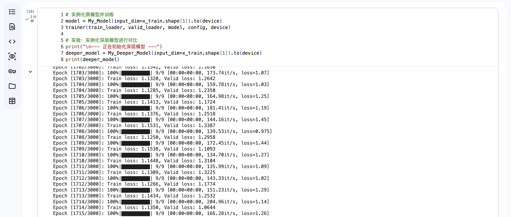
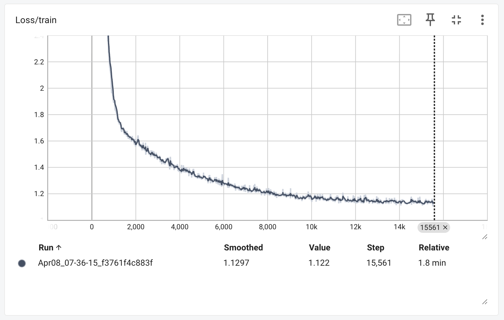
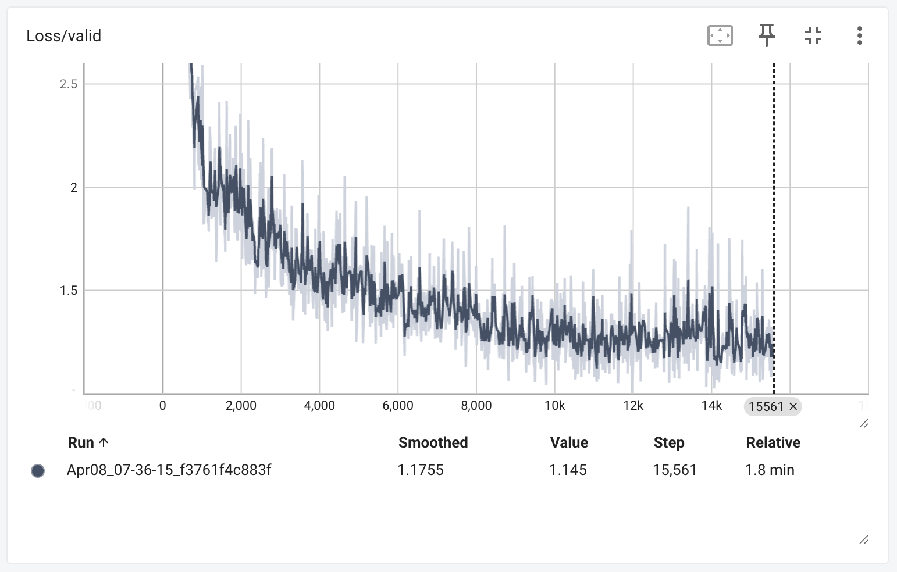
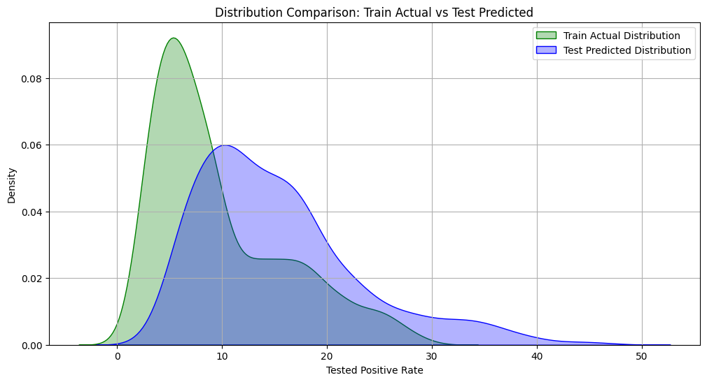
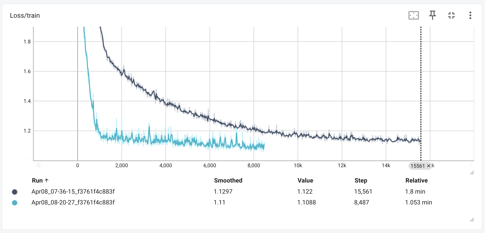
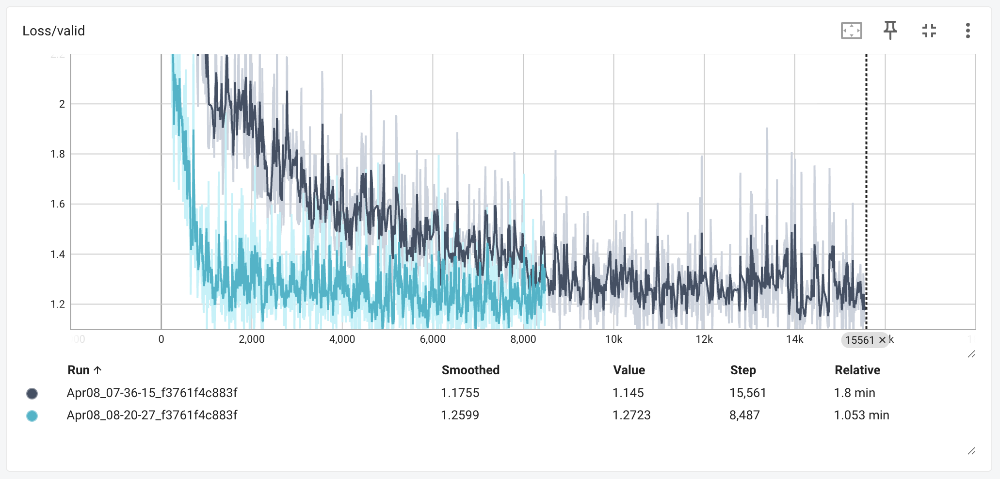

# Day 1 Warmup + HW1

## Colab 使用

### 检测Colab环境：



### 从Google Drive加载数据：

由于示例原数据已失效，跳过。

## PyTorch 基础



学习了PyTorch的基本概念和操作，包括张量（Tensor）的创建、操作等内容

## HW1 COVID-19 病例预测 (回归)

### 特征选择

通过相关性分析，我们可以计算每个特征与目标变量（tested_positive）之间的相关性，并选择相关性较强的特征来训练模型。

```python
import pandas as pd
import seaborn as sns
import matplotlib.pyplot as plt

# 读取数据
train_df = pd.read_csv('./covid.train.csv')

# 计算所有特征与最后一列（目标列）的相关性
correlations = train_df.corr()['tested_positive'].sort_values(ascending=False)

# 打印相关性最强的前 20 个特征（排除目标自身）
print("与 tested_positive 相关性最强的前 20 个特征：")
print(correlations[1:21])

# 获取这些强相关特征的索引，用于修改 select_feat 函数
top_features = correlations[1:21].index.tolist()
feat_indices = [train_df.columns.get_loc(c) for c in top_features]
print(f"\n建议选取的特征索引 (feat_idx): \n{feat_indices}")

# 可视化前 10 个特征的相关性
plt.figure(figsize=(10, 6))
correlations[1:11].plot(kind='bar')
plt.title('Top 10 Features Correlated with tested_positive')
plt.ylabel('Correlation Coefficient')
plt.show()
```

```python
与 tested_positive 相关性最强的前 20 个特征：
tested_positive.1    0.985053
tested_positive.2    0.969467
tested_positive.3    0.953463
tested_positive.4    0.935388
hh_cmnty_cli.3       0.894324
hh_cmnty_cli.4       0.893888
hh_cmnty_cli.2       0.893834
hh_cmnty_cli.1       0.892307
hh_cmnty_cli         0.889813
nohh_cmnty_cli.4     0.887173
nohh_cmnty_cli.3     0.887150
nohh_cmnty_cli.2     0.886093
nohh_cmnty_cli.1     0.884318
nohh_cmnty_cli       0.881647
cli                  0.858100
ili                  0.857306
cli.1                0.854443
ili.1                0.853655
cli.2                0.849627
ili.2                0.848972
Name: tested_positive, dtype: float64

建议选取的特征索引 (feat_idx): 
[69, 85, 101, 117, 88, 104, 72, 56, 40, 105, 89, 73, 57, 41, 38, 39, 54, 55, 70, 71]
```

```python
# TODO: 选择需要的特征 ，这部分可以自己调研一些特征选择的方法并完善.
feat_idx = [69, 85, 101, 117, 88, 104, 72, 56, 40, 105, 89, 73, 57, 41, 38, 39, 54, 55, 70, 71]
```

### 模型训练

使用选定的特征对模型进行训练。



使用tensorboard可视化训练过程：




### 结果展示



### 优化

使用回归任务中通常表现更加稳健收敛的 Adam 优化器，同时直接在优化器参数中实现 L2 正则化。

```python
def trainer(train_loader, valid_loader, model, config, device):

    criterion = nn.MSELoss(reduction='mean') 

    # TODO: 使用 Adam 优化器并加入 L2 正则 (weight_decay)
    # Adam 通常比 SGD 在此类回归任务中表现更稳健
    optimizer = torch.optim.Adam(model.parameters(), lr=config['learning_rate'], weight_decay=1e-5)

    writer = SummaryWriter()

    if not os.path.isdir('./models'):
        os.mkdir('./models')

    n_epochs, best_loss, step, early_stop_count = config['n_epochs'], math.inf, 0, 0

    for epoch in range(n_epochs):
        model.train() 
        loss_record = []

        train_pbar = tqdm(train_loader, position=0, leave=True)
        train_pbar.set_description(f'Epoch [{epoch+1}/{n_epochs}]')
        for x, y in train_pbar:
            optimizer.zero_grad()               
            x, y = x.to(device), y.to(device)   
            pred = model(x)
            loss = criterion(pred, y)
            loss.backward()                     
            optimizer.step()                    
            step += 1
            loss_record.append(loss.detach().item())
            train_pbar.set_postfix({'loss': loss.detach().item()})

        mean_train_loss = sum(loss_record)/len(loss_record)
        writer.add_scalar('Loss/train', mean_train_loss, step)

        model.eval() 
        loss_record = []
        for x, y in valid_loader:
            x, y = x.to(device), y.to(device)
            with torch.no_grad():
                pred = model(x)
                loss = criterion(pred, y)
            loss_record.append(loss.item())

        mean_valid_loss = sum(loss_record)/len(loss_record)
        print(f'Epoch [{epoch+1}/{n_epochs}]: Train loss: {mean_train_loss:.4f}, Valid loss: {mean_valid_loss:.4f}')
        writer.add_scalar('Loss/valid', mean_valid_loss, step)

        if mean_valid_loss < best_loss:
            best_loss = mean_valid_loss
            torch.save(model.state_dict(), config['save_path']) 
            print('Saving model with loss {:.3f}...'.format(best_loss))
            early_stop_count = 0
        else:
            early_stop_count += 1

        if early_stop_count >= config['early_stop']:
            print('\nModel is not improving, so we halt the training session.')
            return
```


