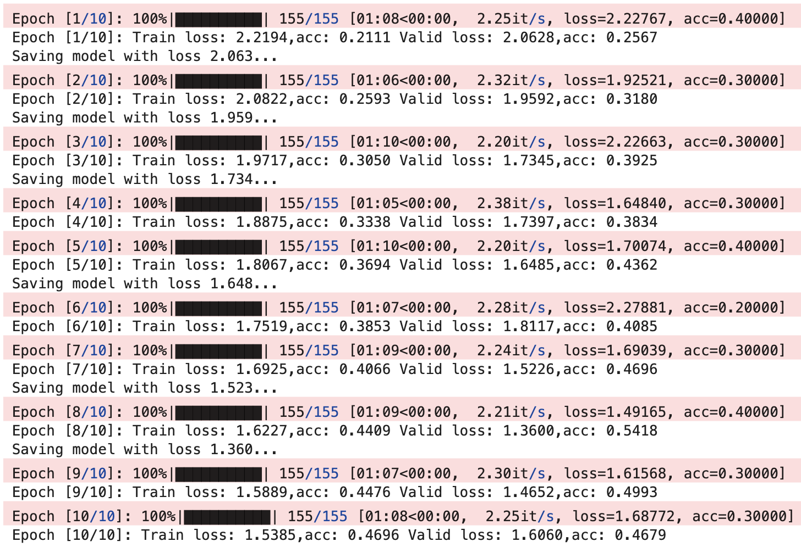

# Day 3 CNN

本节主要记录 HW3 图像分类任务中已经完成的几项尝试，包括图片预处理与数据扩增、自定义 CNN 的初步训练结果。

## 图片处理及数据扩增

在训练集上，加入了随机裁剪、水平翻转、轻微的仿射变换、颜色扰动以及 `AutoAugment`，希望提升模型对尺度、视角和光照变化的鲁棒性。验证集和测试集则只保留确定性的预处理流程，以避免随机增广影响评估结果。

```python
test_tfm = transforms.Compose([
    transforms.Resize((142, 142)),
    transforms.CenterCrop((128, 128)),
    transforms.ToTensor(),
    transforms.Normalize(mean=[0.485, 0.456, 0.406],
                         std =[0.229, 0.224, 0.225]),
])

train_tfm = transforms.Compose([
    # 先放大一点，再随机裁剪到 128
    transforms.Resize((142, 142)),
    transforms.RandomCrop((128, 128)),

    # 食物图像通常适合做水平翻转
    transforms.RandomHorizontalFlip(p=0.5),

    # 轻微旋转/平移/缩放，增强视角鲁棒性
    transforms.RandomAffine(
        degrees=15,
        translate=(0.05, 0.05),
        scale=(0.9, 1.1)
    ),

    # 轻微颜色扰动，模拟光照变化
    transforms.ColorJitter(
        brightness=0.2,
        contrast=0.2,
        saturation=0.2,
        hue=0.05
    ),

    transforms.AutoAugment(transforms.AutoAugmentPolicy.IMAGENET),

    transforms.ToTensor(),
    transforms.Normalize(mean=[0.485, 0.456, 0.406],
                         std =[0.229, 0.224, 0.225]),
])
```

## 尝试现成的网络框架

为了便于和手写 `Classifier` 做比较，在 notebook 中补充了一个 `build_model` 工厂函数，统一支持多种 `torchvision` 预训练骨干网络，并将最后的分类层改为 11 类输出。当前支持的模型包括 `resnet18`、`resnet50`、`densenet121` 和 `efficientnet_b0`。

```python
from torchvision import models


def load_torchvision_model(builder, weights_enum=None, pretrained=True):
    """兼容新旧 torchvision API，并在预训练权重下载失败时回退到随机初始化。"""
    if weights_enum is not None:
        try:
            return builder(weights=weights_enum.DEFAULT if pretrained else None)
        except TypeError:
            pass
        except Exception as e:
            if pretrained:
                print(f"Load pretrained weights failed ({e}), fallback to random init.")
                return builder(weights=None)

    try:
        return builder(pretrained=pretrained)
    except TypeError:
        return builder(pretrained=False)
    except Exception as e:
        if pretrained:
            print(f"Load pretrained weights failed ({e}), fallback to random init.")
            return builder(pretrained=False)
        raise


def build_model(model_name='resnet18', num_classes=11, pretrained=True):
    model_name = model_name.lower()

    if model_name == 'resnet18':
        model = load_torchvision_model(models.resnet18, getattr(models, 'ResNet18_Weights', None), pretrained)
        model.fc = nn.Linear(model.fc.in_features, num_classes)
    elif model_name == 'resnet50':
        model = load_torchvision_model(models.resnet50, getattr(models, 'ResNet50_Weights', None), pretrained)
        model.fc = nn.Linear(model.fc.in_features, num_classes)
    elif model_name == 'densenet121':
        model = load_torchvision_model(models.densenet121, getattr(models, 'DenseNet121_Weights', None), pretrained)
        model.classifier = nn.Linear(model.classifier.in_features, num_classes)
    elif model_name == 'efficientnet_b0':
        model = load_torchvision_model(models.efficientnet_b0, getattr(models, 'EfficientNet_B0_Weights', None), pretrained)
        model.classifier[1] = nn.Linear(model.classifier[1].in_features, num_classes)
    else:
        raise ValueError(f'Unsupported model: {model_name}')

    return model


class Classifier(nn.Module):
    def __init__(self):
        super(Classifier, self).__init__()
        # input 維度 [3, 128, 128]
        self.cnn = nn.Sequential(
            nn.Conv2d(3, 64, 3, 1, 1),  # [64, 128, 128]
            nn.BatchNorm2d(64),
            nn.ReLU(),
            nn.MaxPool2d(2, 2, 0),      # [64, 64, 64]

            nn.Conv2d(64, 128, 3, 1, 1), # [128, 64, 64]
            nn.BatchNorm2d(128),
            nn.ReLU(),
            nn.MaxPool2d(2, 2, 0),      # [128, 32, 32]

            nn.Conv2d(128, 256, 3, 1, 1), # [256, 32, 32]
            nn.BatchNorm2d(256),
            nn.ReLU(),
            nn.MaxPool2d(2, 2, 0),      # [256, 16, 16]

            nn.Conv2d(256, 512, 3, 1, 1), # [512, 16, 16]
            nn.BatchNorm2d(512),
            nn.ReLU(),
            nn.MaxPool2d(2, 2, 0),       # [512, 8, 8]
            
            nn.Conv2d(512, 512, 3, 1, 1), # [512, 8, 8]
            nn.BatchNorm2d(512),
            nn.ReLU(),
            nn.MaxPool2d(2, 2, 0),       # [512, 4, 4]
        )
        self.fc = nn.Sequential(
            nn.Linear(512*4*4, 1024),
            nn.ReLU(),
            nn.Linear(1024, 512),
            nn.ReLU(),
            nn.Linear(512, 11)
        )

    def forward(self, x):
        out = self.cnn(x)
        out = out.view(out.size()[0], -1)
        return self.fc(out)
```

## Ensemble / Soft Vote

在 notebook 中，实现了测试阶段的数据扩增与 soft vote。具体做法是：额外使用 3 份经过 `train_tfm` 处理的测试集 dataloader，再与原始 `test_loader` 一起进行预测，最后对 4 组 logit 做加权软投票，并导出 `submission.csv`。

```python
test_loaders = [test_loader_extra1, test_loader_extra2, test_loader_extra3, test_loader]
loader_nums = len(test_loaders)
loader_pred_list = []
for idx, d_loader in enumerate(test_loaders):
    pred_arr_list = []
    with torch.no_grad():
        tq_bar = tqdm(d_loader)
        tq_bar.set_description(f"[ DataLoader {idx+1}/{loader_nums} ]")
        for data, _ in tq_bar:
            test_pred = model_best(data.to(device))
            logit_pred = test_pred.cpu().data.numpy()
            pred_arr_list.append(logit_pred)
        loader_pred_list.append(np.concatenate(pred_arr_list, axis=0))

pred_arr = np.zeros(loader_pred_list[0].shape)
for pred_arr_t in loader_pred_list:
    pred_arr += pred_arr_t

soft_vote_prediction = np.argmax(
    0.5 * pred_arr / len(loader_pred_list) + 0.5 * loader_pred_list[-1],
    axis=1
)
```

## 训练结果



从训练日志来看，自定义 `Classifier` 已经能够稳定学到有效特征，验证集准确率整体在 0.5 左右波动，说明当前 baseline 是可用的，但仍有进一步提升空间。

## 备注

- 如果环境中缺少 Graphviz 的 `dot` 可执行文件，`model_plot(Classifier, x)` 这一步可以直接跳过，不影响后续训练、预测和生成 CSV。
