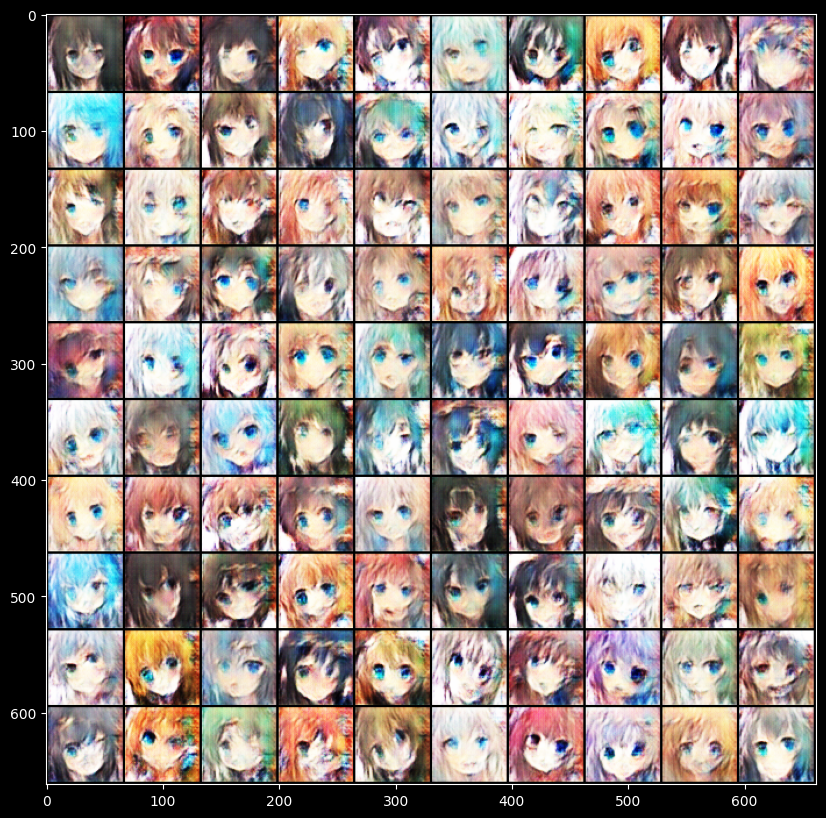
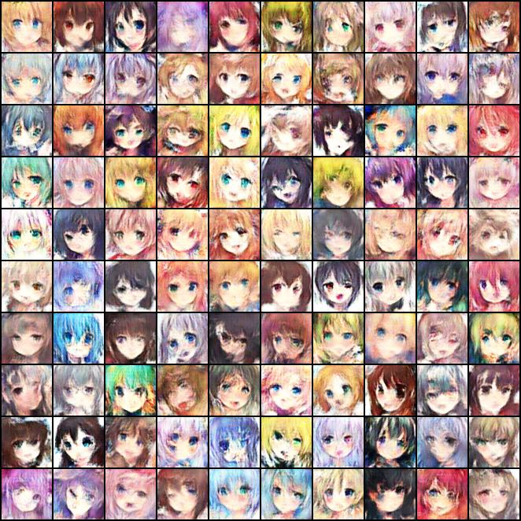
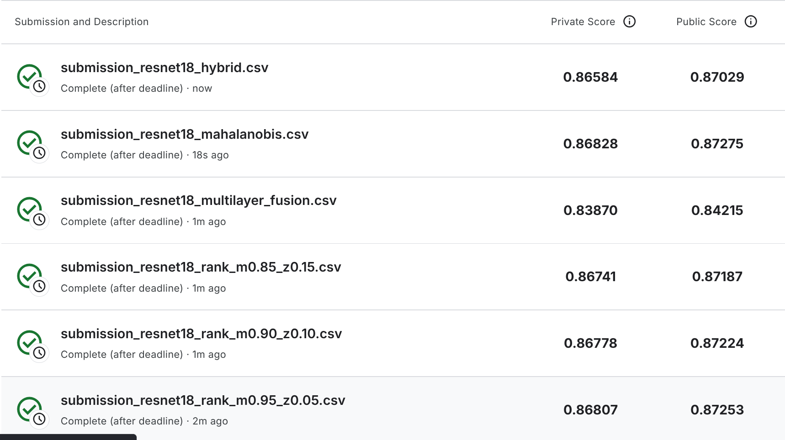

# Day 6 GAN & AbnormalDetect

## HW 6 GAN

使用默认超参数设置，效果如下：



## 模型优化 (WGAN-GP)

为了解决默认 GAN 模型（基础 DCGAN 架构）训练中出现的生成质量差、细节模糊以及模式坍塌（Mode Collapse）等问题，对 `HW06_GAN.ipynb` 进行了以下优化，将其升级为 **WGAN-GP** 架构：

### 数据增强
在 `get_dataset` 的图像预处理管道中加入了随机水平翻转：
```python
transforms.Compose([
    transforms.ToPILImage(),
    transforms.Resize((64, 64)),
    transforms.RandomHorizontalFlip(), # 新增的数据增强
    transforms.ToTensor(),
    transforms.Normalize(mean=(0.5, 0.5, 0.5), std=(0.5, 0.5, 0.5)),
])
```
**说明**：由于动漫人脸具有较高的对称性，水平翻转相当于将有效训练数据量扩大了一倍，极大地增加了模型在训练过程中看到的数据多样性，提高了生成器的泛化能力。

### 判别器结构修改
去除了 Sigmoid，并替换了 Normalization：
```python
# 1. 移除最后一层的 Sigmoid 激活函数
nn.Conv2d(feature_dim * 8, 1, kernel_size=4, stride=1, padding=0)  # output -> (batch, 1, 1, 1)
# nn.Sigmoid() removed for WGAN-GP

# 2. 将 BatchNorm2d 替换为 InstanceNorm2d
def conv_bn_lrelu(self, in_dim, out_dim):
    return nn.Sequential(
        nn.Conv2d(in_dim, out_dim, 4, 2, 1),
        nn.InstanceNorm2d(out_dim, affine=True), # 替换了 nn.BatchNorm2d
        nn.LeakyReLU(0.2),
    )
```
**说明**：
- 移除了 `Sigmoid` 函数，因为 WGAN 的判别器（Critic）输出的是一个无界的 Wasserstein 距离分数，而不是 [0, 1] 之间的概率值。
- 将所有的 `BatchNorm2d` 替换为 `InstanceNorm2d`（保留 affine 可学习参数）。这是 WGAN-GP 的数学硬性要求，因为 Batch Normalization 会导致同一个 Batch 内的样本相互影响，破坏梯度惩罚（Gradient Penalty）的独立计算条件。

### 损失函数与梯度惩罚
在 `TrainerGAN` 中添加了计算梯度惩罚的 `gp()` 函数：
```python
def gp(self, real_samples, fake_samples):
    alpha = torch.rand((real_samples.size(0), 1, 1, 1)).cuda()
    interpolates = (alpha * real_samples + ((1 - alpha) * fake_samples)).requires_grad_(True)
    d_interpolates = self.D(interpolates)
    fake = torch.ones(d_interpolates.size()).cuda()
    gradients = torch.autograd.grad(
        outputs=d_interpolates,
        inputs=interpolates,
        grad_outputs=fake,
        create_graph=True,
        retain_graph=True,
        only_inputs=True,
    )[0]
    gradients = gradients.view(gradients.size(0), -1)
    gradient_penalty = ((gradients.norm(2, dim=1) - 1) ** 2).mean()
    return gradient_penalty
```
并更新了训练过程中的损失函数计算：
```python
# 判别器损失 (Discriminator Loss) 包含梯度惩罚项
gradient_penalty = self.gp(r_imgs, f_imgs)
loss_D = -torch.mean(r_logit) + torch.mean(f_logit) + 10 * gradient_penalty

# 生成器损失 (Generator Loss)
loss_G = -torch.mean(self.D(f_imgs))
```
**说明**：这是 WGAN-GP 稳定训练的核心。通过在真实样本和生成样本之间的随机插值点上，强行限制梯度的范数（使其趋近于 1），满足 1-Lipschitz 连续性条件。这使得即便判别器被训练得非常完美，生成器也能持续获得稳定且不消失的梯度，从根本上缓解了模式坍塌问题。

### 优化器与超参数调整
更新了 `config` 并在 `TrainerGAN` 中修改了 Adam 优化器：
```python
config = {
    "model_type": "WGAN-GP",
    "batch_size": 512, # 从 64 提升至 512
    "lr": 2e-4,        # 从 1e-4 提升至 2e-4
    "n_epoch": 50,     # 从 15 提升至 50
    "n_critic": 5,     # 从 1 提升至 5
    "z_dim": 100,
    "workspace_dir": workspace_dir, 
}
```
修改 Adam 优化器的 `betas` 参数：
```python
self.opt_D = torch.optim.Adam(self.D.parameters(), lr=self.config["lr"], betas=(0.0, 0.9))
self.opt_G = torch.optim.Adam(self.G.parameters(), lr=self.config["lr"], betas=(0.0, 0.9))
```
修改之后的结果如下：



## HW 8 AbnormalDetect

本次对 `HW08_AbnormalDetect.ipynb` 的修改主要分成三部分：先修复 PyTorch 2.6 下的模型加载问题，再改进 VAE 训练与推理逻辑，最后补充更强的 CNN 自编码器、批量导出和融合工具。

### 1. Checkpoint 保存与加载修复

原始 notebook 直接使用整模型保存：

```python
torch.save(model, 'last_model_{}.pt'.format(model_type))
model = torch.load(checkpoint_path)
```

这在 PyTorch 2.6 中会因为 `torch.load()` 默认启用 `weights_only=True` 而报错。现已改为：

```python
checkpoint = {
    'epoch': epoch + 1,
    'model_type': model_type,
    'model_state_dict': model.state_dict(),
}
torch.save(checkpoint, f'best_model_{model_type}.pt')
```

加载时兼容新旧两种格式：

```python
checkpoint = torch.load(checkpoint_path, map_location=device, weights_only=False)
if isinstance(checkpoint, dict) and 'model_state_dict' in checkpoint:
    loaded_model_type = checkpoint.get('model_type', model_type)
    model = build_model(loaded_model_type).to(device)
    model.load_state_dict(checkpoint['model_state_dict'])
else:
    model = checkpoint.to(device)
```

### 2. VAE 结构与训练流程改进

原始版本的 VAE 存在两个明显问题：

- `mu/logvar` 输出层后使用了 `ReLU`，会破坏潜变量分布表达
- 推理阶段仍然随机采样 latent，导致同一模型多次提交分数不稳定

修正后的关键实现如下：

```python
self.enc_out_1 = nn.Conv2d(24, 48, 4, stride=2, padding=1)
self.enc_out_2 = nn.Conv2d(24, 48, 4, stride=2, padding=1)

def reparametrize(self, mu, logvar):
    if not self.training:
        return mu
    std = torch.exp(0.5 * logvar)
    eps = torch.randn_like(std)
    return mu + eps * std
```

同时将 VAE 损失改为更稳定的 `beta-VAE` 写法：

```python
def loss_vae(recon_x, x, mu, logvar, beta=1e-4):
    recon_loss = F.mse_loss(recon_x, x, reduction='mean')
    kld = -0.5 * torch.mean(1 + logvar - mu.pow(2) - logvar.exp())
    return recon_loss + beta * kld
```

训练流程也补齐了验证集和最佳模型选择：

```python
train_dataset, val_dataset = random_split(full_dataset, [train_size, val_size], generator=split_generator)
optimizer = AdamW(model.parameters(), lr=learning_rate, weight_decay=weight_decay)
scheduler = torch.optim.lr_scheduler.CosineAnnealingLR(optimizer, T_max=num_epochs)
```

VAE 实验配置：

```python
num_epochs = 40
batch_size = 512
learning_rate = 3e-4
weight_decay = 1e-5
beta = 1e-4
val_ratio = 0.1
```

### 3. 通用推理与分数导出函数

为了支持不同模型和不同异常分数，新增了统一的导出工具函数：

```python
def samplewise_reconstruction_error(recon_x, x, score_mode='mse'):
    if score_mode == 'l1':
        loss_map = torch.abs(recon_x - x)
    elif score_mode == 'mse':
        loss_map = (recon_x - x) ** 2
    reduce_dims = tuple(range(1, loss_map.ndim))
    return loss_map.mean(dim=reduce_dims)

def export_submission(checkpoint_path, out_file, data_loader, device, override_score_mode=None):
    model, loaded_model_type, checkpoint_score_mode, checkpoint = load_trained_model(checkpoint_path, device)
    score_mode = override_score_mode or checkpoint_score_mode
    scores = predict_scores(model, data_loader, loaded_model_type, score_mode, device)
    pd.DataFrame(scores, columns=['score']).to_csv(out_file, index_label='ID')
```

### 4. 强化版 CNN Autoencoder

为了进一步冲分，在 notebook 中新增了更深的卷积自编码器，并把默认实验切换为 `cnn`：

```python
class conv_autoencoder(nn.Module):
    def __init__(self):
        super(conv_autoencoder, self).__init__()
        self.encoder = nn.Sequential(
            nn.Conv2d(3, 32, 4, stride=2, padding=1),
            nn.BatchNorm2d(32),
            nn.LeakyReLU(0.2, inplace=True),
            nn.Conv2d(32, 64, 4, stride=2, padding=1),
            nn.BatchNorm2d(64),
            nn.LeakyReLU(0.2, inplace=True),
            nn.Conv2d(64, 128, 4, stride=2, padding=1),
            nn.BatchNorm2d(128),
            nn.LeakyReLU(0.2, inplace=True),
            nn.Conv2d(128, 256, 4, stride=2, padding=1),
            nn.BatchNorm2d(256),
            nn.LeakyReLU(0.2, inplace=True),
        )
        self.decoder = nn.Sequential(
            nn.ConvTranspose2d(256, 128, 4, stride=2, padding=1),
            nn.BatchNorm2d(128),
            nn.ReLU(inplace=True),
            nn.ConvTranspose2d(128, 64, 4, stride=2, padding=1),
            nn.BatchNorm2d(64),
            nn.ReLU(inplace=True),
            nn.ConvTranspose2d(64, 32, 4, stride=2, padding=1),
            nn.BatchNorm2d(32),
            nn.ReLU(inplace=True),
            nn.ConvTranspose2d(32, 3, 4, stride=2, padding=1),
            nn.Tanh(),
        )
```

CNN 实验配置：

```python
experiment_configs = {
    'cnn': {
        'num_epochs': 60,
        'batch_size': 256,
        'learning_rate': 5e-4,
        'weight_decay': 1e-5,
        'criterion_name': 'l1',
        'score_mode': 'l1',
        'beta': 0.0,
        'save_every': 5,
    },
}
```

### 5. 批量导出、Rank Ensemble 与 Latent Scoring

为了比较不同 epoch 的效果，又补充了：

- `checkpoints/` 周期性保存 `cnn_epoch_005.pt ~ cnn_epoch_060.pt`
- 批量导出 `best/40/50/60 epoch` 的 submission
- 基于 rank 的 submission 融合
- 基于 encoder latent feature 的异常分数工具链

对应新增函数包括：

```python
def extract_latent_features(model, img, model_type): ...
def fit_latent_stats(model, data_loader, model_type, device): ...
def predict_latent_scores(model, data_loader, model_type, device, mean, std): ...
def export_latent_submission(checkpoint_path, train_loader, test_loader, out_file, device): ...
```

### 6. 预训练 ResNet18 特征异常检测

在 `VAE` 与 `CNN Autoencoder` 的像素重建路线达到瓶颈后，最终有效的提升来自 `ImageNet` 预训练特征。思路是：

1. 用 `ResNet18` 提取每张图像的语义特征。
2. 在训练集特征空间中拟合正常样本分布。
3. 用测试样本到该分布的距离作为异常分数。

相比像素重建，这种方法对局部纹理噪声不敏感，但对“整体语义异常”更敏感，因此在 leaderboard 上明显优于自编码器方法。

#### 6.1 预训练模型缓存路径

由于运行环境的默认 `~/.cache/torch` 不可写，在 notebook 顶部增加了：

```python
os.environ.setdefault('TORCH_HOME', '/tmp/torch-cache')
```

这样 `torchvision` 的预训练权重会被下载到 `/tmp/torch-cache`。

#### 6.2 ResNet18 输入预处理

训练数据原本已经被归一化到 `[-1, 1]`，但 `ResNet18` 预训练权重要求输入满足 `ImageNet` 标准。因此新增了统一预处理函数：

```python
def preprocess_for_resnet18(img):
    img = (img + 1.0) / 2.0
    img = F.interpolate(img, size=(224, 224), mode='bilinear', align_corners=False)
    mean = torch.tensor([0.485, 0.456, 0.406], device=img.device).view(1, 3, 1, 1)
    std = torch.tensor([0.229, 0.224, 0.225], device=img.device).view(1, 3, 1, 1)
    return (img - mean) / std
```

#### 6.3 单层特征提取与距离建模

首先使用 `ResNet18` 最后一层卷积特征做异常检测：

```python
def build_resnet18_feature_extractor(device):
    weights = models.ResNet18_Weights.DEFAULT
    backbone = models.resnet18(weights=weights)
    feature_extractor = nn.Sequential(*list(backbone.children())[:-1]).to(device)
    feature_extractor.eval()
    return feature_extractor
```

特征抽取后，在训练集特征上拟合高斯分布，并计算两种分数：

- `Mahalanobis distance`
- `z-score distance`

对应实现：

```python
def fit_resnet18_gaussian(train_features, reg=1e-3):
    mean = train_features.mean(dim=0)
    centered = train_features - mean
    cov = centered.T @ centered / max(train_features.shape[0] - 1, 1)
    cov = cov + reg * torch.eye(cov.shape[0], dtype=cov.dtype)
    precision = torch.linalg.inv(cov)
    std = train_features.std(dim=0).clamp_min(1e-6)
    return mean, precision, std

def mahalanobis_score(features, mean, precision):
    delta = features - mean
    return torch.sum((delta @ precision) * delta, dim=1)

def zscore_score(features, mean, std):
    z = (features - mean) / std
    return torch.mean(z ** 2, dim=1)
```

将这三步封装后导出三份 submission：

```python
def export_resnet18_submissions(train_loader, test_loader, device, out_prefix='submission_resnet18'):
    feature_extractor = build_resnet18_feature_extractor(device)
    train_features = extract_resnet18_features(feature_extractor, train_loader, device)
    test_features = extract_resnet18_features(feature_extractor, test_loader, device)
    mean, precision, std = fit_resnet18_gaussian(train_features)
    maha = mahalanobis_score(test_features, mean, precision).numpy()
    zscore = zscore_score(test_features, mean, std).numpy()
    ...
```

对应导出的文件为：

- `submission_resnet18_mahalanobis.csv`
- `submission_resnet18_zscore.csv`
- `submission_resnet18_hybrid.csv`

#### 6.4 Rank Average 融合

为了方便对不同 submission 做非参数融合，增加了通用的 rank average 函数：

```python
def rank_average(file_weights, out_file):
    available_specs = [(path, weight) for path, weight in file_weights if os.path.exists(path)]
    weights = np.array([weight for _, weight in available_specs], dtype=np.float64)
    weights = weights / weights.sum()
    blended_score = None
    for (path, _), weight in zip(available_specs, weights):
        ranked_score = pd.read_csv(path)['score'].rank(pct=True, method='average').to_numpy()
        blended_score = weight * ranked_score if blended_score is None else blended_score + weight * ranked_score
    pd.DataFrame({'score': blended_score}).to_csv(out_file, index_label='ID')
```

在 `Mahalanobis` 明显优于 `z-score` 的情况下，又增加了一组权重搜索：

- `0.95 / 0.05`
- `0.90 / 0.10`
- `0.85 / 0.15`

对应文件：

- `submission_resnet18_rank_m0.95_z0.05.csv`
- `submission_resnet18_rank_m0.90_z0.10.csv`
- `submission_resnet18_rank_m0.85_z0.15.csv`

#### 6.5 多层特征融合

除了最后一层特征，还尝试了 `layer2 / layer3 / layer4` 多层特征融合。为此实现了一个多层特征提取器：

```python
class ResNet18MultiLayerExtractor(nn.Module):
    def __init__(self, weights=models.ResNet18_Weights.DEFAULT):
        super().__init__()
        backbone = models.resnet18(weights=weights)
        self.conv1 = backbone.conv1
        self.bn1 = backbone.bn1
        self.relu = backbone.relu
        self.maxpool = backbone.maxpool
        self.layer1 = backbone.layer1
        self.layer2 = backbone.layer2
        self.layer3 = backbone.layer3
        self.layer4 = backbone.layer4

    def forward(self, x):
        feats = {}
        x = self.maxpool(self.relu(self.bn1(self.conv1(x))))
        x = self.layer1(x); feats['layer1'] = F.adaptive_avg_pool2d(x, 1).flatten(1)
        x = self.layer2(x); feats['layer2'] = F.adaptive_avg_pool2d(x, 1).flatten(1)
        x = self.layer3(x); feats['layer3'] = F.adaptive_avg_pool2d(x, 1).flatten(1)
        x = self.layer4(x); feats['layer4'] = F.adaptive_avg_pool2d(x, 1).flatten(1)
        return feats
```

然后对 `layer2 / layer3 / layer4` 分别计算 `Mahalanobis` 分数，并再做一轮 rank 融合：

```python
def export_resnet18_multilayer_submissions(train_loader, test_loader, device, out_prefix='submission_resnet18_multilayer'):
    feature_extractor = ResNet18MultiLayerExtractor().to(device)
    ...
    layer_weights = {'layer2': 0.15, 'layer3': 0.35, 'layer4': 0.5}
    ...
```

最终输出：

- `submission_resnet18_multilayer_layer2_mahalanobis.csv`
- `submission_resnet18_multilayer_layer3_mahalanobis.csv`
- `submission_resnet18_multilayer_layer4_mahalanobis.csv`
- `submission_resnet18_multilayer_fusion.csv`

### 7. 实验结果记录

本轮完整实验的主要结果如下。

#### 7.1 自编码器阶段

- 原始 notebook 直接运行时，Kaggle 分数约为 `0.53`
- 修复 VAE 的保存/加载、改造训练流程并重新训练后，Kaggle 分数提升到约 `0.68`
- 强化版 `CNN Autoencoder` 训练 `60` 个 epoch 后，`submission_best_model_cnn.csv` 的分数约为 `0.65`
- `cnn_epoch_040.csv`、`cnn_epoch_050.csv`、`cnn_epoch_060.csv` 与 `best_model_cnn` 基本接近
- `cnn` 的 `latent + reconstruction hybrid` 分数约为 `0.67`

CNN 训练后半程的验证集 loss 记录如下，最佳验证集出现在 `epoch 58` 左右：

```text
Epoch 55/60 | train_loss=0.039308 | val_loss=0.038074 | best_epoch=55
Epoch 56/60 | train_loss=0.039124 | val_loss=0.037991 | best_epoch=56
Epoch 57/60 | train_loss=0.039139 | val_loss=0.038002 | best_epoch=56
Epoch 58/60 | train_loss=0.039135 | val_loss=0.037961 | best_epoch=58
Epoch 59/60 | train_loss=0.039098 | val_loss=0.037967 | best_epoch=58
Epoch 60/60 | train_loss=0.039060 | val_loss=0.038216 | best_epoch=58
```

#### 7.2 预训练 ResNet18 特征阶段

`ResNet18` 路线的效果显著优于自编码器。提交结果如下：



从结果可以看出：

- 单独的 `Mahalanobis` 已经是本轮最优，说明训练集特征分布建模本身就足够有效
- `Mahalanobis + z-score` 的 rank 融合没有超过单独的 `Mahalanobis`
- 将多层特征简单融合后反而下降，说明低层特征引入了更多纹理噪声
- 最有效的信号来自 `ResNet18` 高层语义特征，而不是像素级重建误差

### 8. 结论

本次 `HW08 AbnormalDetect` 的优化过程可以概括为：

1. 修复原 notebook 在 PyTorch 2.6 下的 checkpoint 加载问题
2. 规范化 `VAE` 的结构、损失函数和推理流程
3. 试验更深的 `CNN Autoencoder` 与各种无监督融合方案
4. 最终发现 `预训练 ResNet18 + Mahalanobis distance` 才是最有效的方法

最终最佳结果为：

- `submission_resnet18_mahalanobis.csv`
- `Private Score = 0.86828`
- `Public Score = 0.87275`

该成绩已经可以稳定进入排行榜前列，本次实验在 leaderboard 上可达到第 `4` 名左右。
