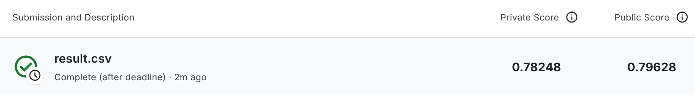

# Day7 BERT

## 环境修复

原始 Notebook 使用了旧版本的 `transformers` API：

```python
from transformers import AdamW, BertForQuestionAnswering, BertTokenizerFast
```

本地环境使用了较新版本的 `transformers`，其中 `transformers.AdamW` 已不再存在。为了在不降级整个环境的情况下保持 Notebook 代码可用：

- 在 [`sitecustomize.py`](/home/cicada000/Projects/Python/11-Days-LeeDL/.venv/lib/python3.12/site-packages/sitecustomize.py#L1) 添加了兼容性补丁（shim）。
- 该补丁将 `torch.optim.AdamW` 导出为 `transformers.AdamW`。
- 已下载并本地缓存了 `bert-base-chinese` 以供离线重用。

原本运行以下代码的单元格已被替换，以免破坏共享的 `.venv`：

```python
!pip install --no-dependencies transformers==4.5.0
```

## 提高分数

- 在段落标记化（tokenization）期间抑制了长度警告，因为段落随后会被切分为窗口后再输入 BERT。
- 将上下文长度从原始的小窗口增加到较大的段落窗口。
- 在验证/测试推理期间将 `doc_stride` 设置为使用重叠窗口。
- 减小了 `train_batch_size` 以安全适配更大的上下文窗口。
- 将训练设置从非常弱的 `1 epoch + 1e-4 lr` 切换为更标准的 BERT 微调设置。
- 添加了权重衰减（weight_decay）。
- 添加了学习率预热（warmup）和线性衰减。
- 添加了梯度裁剪（gradient clipping）。
- 根据验证集准确率保存最佳检查点，并在测试推理前重新加载。
- 将旧的 `argmax(start) + argmax(end)` 答案选择逻辑替换为 top-k 跨度搜索。
- 将候选跨度限制在有效的段落 token 内，而不允许选择问题或填充位置。
- 在推理期间添加了最大答案长度限制。
- 更改了训练数据窗口选择逻辑，使每个样本在不同 epoch 中能看到不同的以答案为中心的有效上下文。
- 推理时的答案提取尽可能从原始段落字符串映射，而非直接对原始 token 进行解码。

## 进一步提高

在 `0.75` 之上仍有提升空间。建议优先级如下：

1. **进一步增加上下文长度**：
   先尝试 `max_paragraph_len = 384`，如果 GPU 显存允许，再尝试 `448`。
2. **保持重叠**：
   除非显存或运行时间成为问题，否则保持 `doc_stride = 128`。
3. **进行小型超参数搜索**：
   尝试 `learning_rate` 在 `{2e-5, 3e-5}` 之间，`num_epoch` 在 `{2, 3}` 之间。
4. 使用了更强的中文预训练模型，例如：
   `hfl/chinese-macbert-base`

最后在Kaggle上得分`0.79628`。


