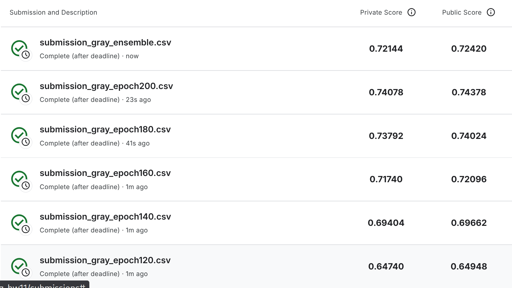
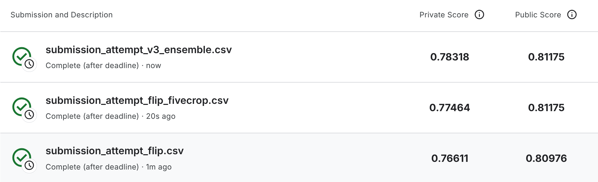
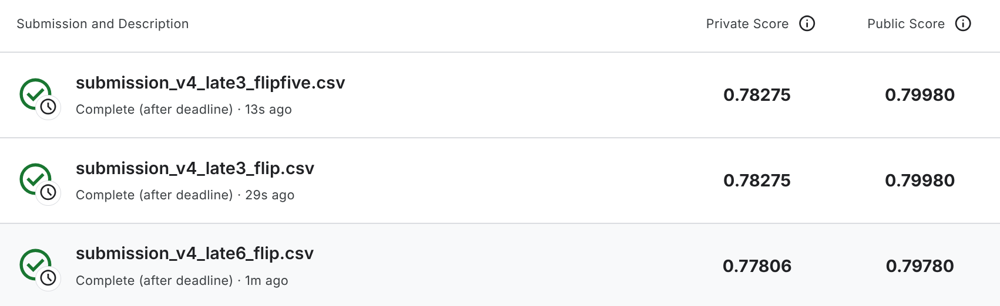

# Day 9 Adaptation & NetworkCompress

## HW 11 Adaptation

本次实验基于原始的 `HW11-Adaptation.ipynb` 进行优化，目标是提升 `real_or_drawing` 数据集在 Kaggle leaderboard 上的分类分数。

原始 notebook 直接运行并提交 `DaNN_submission.csv` 时，得分大约在 `0.52` 左右。

---

## 原始 `HW11-Adaptation.ipynb` 的设置

原始 notebook 的核心流程是标准 `DaNN`：

### 1. 数据预处理

源域 `source` 使用 `Canny` 边缘提取，目标域 `target` 使用灰度图：

```python
src_transform = transforms.Compose([
    transforms.Grayscale(),
    transforms.Lambda(lambda x: cv2.Canny(np.array(x), 170, 300)),
    transforms.ToPILImage(),
    transforms.RandomHorizontalFlip(),
    transforms.RandomRotation(15, fill=(0,)),
    transforms.ToTensor(),
])

tgt_transform = transforms.Compose([
    transforms.Grayscale(),
    transforms.Resize((32, 32)),
    transforms.RandomHorizontalFlip(),
    transforms.RandomRotation(15, fill=(0,)),
    transforms.ToTensor(),
])
```

这里有两个明显问题：

- `target` 的训练与测试共用了同一套 transform
- 推理阶段仍然会执行 `RandomHorizontalFlip` 和 `RandomRotation`，导致提交结果具有随机性

### 2. 训练策略

原始 notebook 的训练损失如下：

```python
loss = class_criterion(class_logits, source_label) - lamb * domain_criterion(domain_logits, domain_label)
```

并且固定：

```python
lamb = 0.1
```

训练 `200` 个 epoch，并且每一轮都直接覆盖保存：

```python
torch.save(feature_extractor.state_dict(), f'extractor_model.bin')
torch.save(label_predictor.state_dict(), f'predictor_model.bin')
```

也就是说，原始 notebook 实际上只保留了“最后一轮权重”，没有做验证集筛选，也没有做后期 checkpoint 对比。

---

## 优化过程

本次对 `HW11-Adaptation.ipynb` 的探索主要分成三步：先修复推理阶段的随机增强问题，再比较不同源域预处理方式，最后采用更适合 leaderboard 的灰度输入 + 晚期 checkpoint 导出方案。

### 1. 拆分目标域训练与测试变换

首先将 `target` 的训练增强与测试增强分开：

```python
tgt_train_transform = transforms.Compose([
    transforms.Grayscale(),
    transforms.Resize((32, 32)),
    transforms.RandomHorizontalFlip(),
    transforms.RandomRotation(15, fill=(0,)),
    transforms.ToTensor(),
])

tgt_test_transform = transforms.Compose([
    transforms.Grayscale(),
    transforms.Resize((32, 32)),
    transforms.ToTensor(),
])
```

**说明**：这一步的目的是让提交 `csv` 时的推理变成确定性过程，避免同一个模型多次提交分数不一致。

### 2. 比较三种源域预处理方式

为了判断到底是“模型不够强”还是“输入形式不对”，对源域 `source` 进行了三种预处理对比：

- `canny`
- `blur_canny`
- `gray`

其中：

```python
source-mode = "canny" / "blur_canny" / "gray"
```

实验结论非常明确：

- `canny` 路线分数最低
- `blur_canny` 比 `canny` 更差
- `gray` 明显优于前两者

这说明本题最大的误区不是模型深度不够，而是**持续把 source 域硬转换成边缘图**。  
目标域虽然是 drawing，但它更接近“干净的灰度线稿”，而不是 source 照片经过 `Canny` 后产生的大量背景噪声边缘。

### 3. 最终采用的训练脚本

最终将实验整理为独立脚本 `hw11_adaptation_optimized.py`，核心方向如下：

- 源域输入改为 `gray`
- 不再按 source 验证集选“最终模型”
- 使用全量 source 数据参与训练
- 训练前期使用短暂 warmup
- 中后期使用更强的 `DaNN`
- 固定导出晚期 checkpoint：`120, 140, 160, 180, 200`
- 同时导出单 checkpoint 提交文件与 ensemble 提交文件

---

## 实验结果记录

### 1. 早期三组预处理对比

三组源域预处理的主要结果如下：

- `canny`
  - source-only 分数约 `0.21`
  - adaptation 分数约 `0.47`

- `blur_canny`
  - source-only 分数约 `0.17`
  - adaptation 分数约 `0.44`

- `gray`
  - source-only 分数约 `0.35`
  - adaptation 分数约 `0.60`

从这里可以看出，`gray` 是后续继续优化的唯一合理方向。

### 2. 最终灰度输入方案的 leaderboard 结果

最终脚本导出了以下文件：

- `outputs/hw11_gray_dann/submission_gray_epoch120.csv`
- `outputs/hw11_gray_dann/submission_gray_epoch140.csv`
- `outputs/hw11_gray_dann/submission_gray_epoch160.csv`
- `outputs/hw11_gray_dann/submission_gray_epoch180.csv`
- `outputs/hw11_gray_dann/submission_gray_epoch200.csv`
- `outputs/hw11_gray_dann/submission_gray_ensemble.csv`

对应 Kaggle 分数如下：



### 3. 后续继续训练的结果

在 `epoch 200` 取得最佳结果后，又继续尝试了更晚的 checkpoint：

- `epoch 220`
- `epoch 240`

但这两次提交的分数都回落到了 `0.68` 左右，因此没有继续采用。

这说明：

- `epoch 200` 附近已经是当前训练配置下的最佳点
- 后续继续训练会开始伤害 target 域表现

---

## 最终结论

最终最佳结果为：

- `submission_gray_epoch200.csv`
- `Private Score = 0.74078`
- `Public Score = 0.74378`

对于当前仓库状态，这是本次实验得到的最佳方案。


## HW 13 NetworkCompress

本次实验基于原始的 `HW13-networkCompress.ipynb` 继续修改，目标是把 `food11-hw13` 的 Kaggle 提交分数从原始 notebook 的 `0.5` 左右继续提升到更接近 `Boss Baseline` 的水平。


## 原始设置

原始 notebook 的核心流程是一个标准的轻量 student + knowledge distillation 基线。

### TODO 修改成自己的网络框架


  - 当前主线 notebook `StudyRecord/Day9/HW13_networkCompress.ipynb` 已经不再使用原始 notebook 里的默认 `StudentNet`
  - 当前版本改成了基于 `InvertedResidual` 的轻量 student network
  - 这一点属于对“自己设计 student network”这一项的直接回答

### TODO 完成损失函数的定义

  - 当前主线 notebook 已经实现了 `loss_fn_kd(...)`
  - 损失函数同时结合了 `KLDivLoss` 与 `CrossEntropyLoss`
  - 这一点属于对“完成知识蒸馏损失函数定义”这一项的直接回答

### 数据预处理

原始 notebook 使用的 transform 比较保守：

```python
test_tfm = transforms.Compose([
    transforms.Resize(256),
    transforms.CenterCrop(224),
    transforms.ToTensor(),
    normalize,
])

train_tfm = transforms.Compose([
    transforms.Resize(256),
    transforms.CenterCrop(224),
    transforms.RandomHorizontalFlip(),
    transforms.ToTensor(),
    normalize,
])
```

这里的问题是：

- 训练增强比较弱，几乎只有 `RandomHorizontalFlip`
- 没有更强的裁剪、颜色扰动、擦除等正则化方法

### Student Network

原始 notebook 里的 student network 仍然是比较早期的 depthwise-pointwise 堆叠结构：

```python
class StudentNet(nn.Module):
    def __init__(self):
        super(StudentNet, self).__init__()
        self.cnn = nn.Sequential(
            dwpw_conv(3, 32, 3, stride=1, padding=0),
            nn.BatchNorm2d(32),
            nn.ReLU(),
            dwpw_conv(32, 32, 3, stride=1, padding=0),
            nn.BatchNorm2d(32),
            nn.ReLU(),
            nn.MaxPool2d(2, 2, 0),
            ...
        )
```

这个结构虽然满足参数量限制，但表达能力偏弱，和教师模型之间的容量差距比较大。

### 蒸馏损失与训练策略

原始 notebook 使用：

```python
opt = torch.optim.Adam(student_model.parameters(), lr=cfg['lr'], weight_decay=cfg['weight_decay'])
```

蒸馏损失是：

```python
def loss_fn_kd(student_logits, labels, teacher_logits, alpha=0.5, temperature=1.15):
    kl_loss = torch.nn.KLDivLoss(reduction='mean', log_target=True)
    ce_loss = torch.nn.CrossEntropyLoss(reduction='mean')
    sft = nn.Softmax(dim=-1)
    return alpha * temperature * temperature * kl_loss(sft(student_logits/temperature), sft(teacher_logits/temperature)) \
            + (1-alpha) * ce_loss(student_logits, labels)
```

并且训练阶段主要特征是：

- `n_epochs = 20`
- 没有 scheduler
- 没有 mixup / label smoothing / EMA
- 只在 `training` 上训练，用 `validation` 选最优
- 推理阶段只做单视角预测，没有 TTA


## 主要改动

本次相对原始 notebook 的修改，主要集中在五个方向。

### 更强的数据增强与数据加载

当前 notebook 将训练增强改成：

```python
train_tfm = transforms.Compose([
    transforms.RandomResizedCrop(224, scale=(0.75, 1.0)),
    transforms.RandomHorizontalFlip(p=0.5),
    transforms.RandomApply([
        transforms.ColorJitter(brightness=0.25, contrast=0.25, saturation=0.25, hue=0.08)
    ], p=0.8),
    transforms.RandomRotation(15),
    transforms.RandomPerspective(distortion_scale=0.15, p=0.2),
    transforms.ToTensor(),
    normalize,
    transforms.RandomErasing(p=0.25, scale=(0.02, 0.12), ratio=(0.3, 3.3), value=0),
])
```

并且补充了：

- `Image.open(fname).convert('RGB')`，避免输入通道不一致
- `num_workers`
- `persistent_workers`
- `full_train_loader`，用于后续全量微调

### Student Network 改成更接近上限的轻量结构

当前 notebook 里的 student 改成了基于 `InvertedResidual` 的结构，并把参数量推进到接近上限：

```python
class StudentNet(nn.Module):
    def __init__(self):
        super().__init__()
        self.features = nn.Sequential(
            nn.Conv2d(3, 16, 3, 2, 1, bias=False),
            nn.BatchNorm2d(16),
            nn.Hardswish(inplace=True),
            InvertedResidual(16, 24, 2, 3),
            InvertedResidual(24, 32, 2, 3),
            InvertedResidual(32, 64, 2, 3),
            InvertedResidual(64, 64, 1, 2),
            InvertedResidual(64, 96, 1, 3),
            nn.Conv2d(96, 256, 1, 1, 0, bias=False),
            nn.BatchNorm2d(256),
            nn.Hardswish(inplace=True),
            nn.AdaptiveAvgPool2d((1, 1)),
        )
        self.dropout = nn.Dropout(p=0.2)
        self.fc = nn.Linear(256, 11)
```

当前模型参数量约为：

- `98,179`

也就是说，相比原始版，这一版更接近作业允许的 `100,000` 上限。

### 蒸馏损失改得更稳定

当前 notebook 将蒸馏改成：

- `temperature = 6.0`
- `alpha = 0.7`
- `label_smoothing = 0.1`
- 加入 `mixup`

核心损失写法变成：

```python
soft_loss = kl_criterion(
    F.log_softmax(student_logits / temperature, dim=1),
    F.softmax(teacher_logits / temperature, dim=1),
) * (temperature ** 2)
```

相比原始写法，这一版更符合常见 KD 的实现方式，也额外补了：

- `CrossEntropyLoss(label_smoothing=...)`
- `mixup_batch(...)`

### 训练流程改成两阶段

当前 notebook 的训练流程不再是单纯的 `train -> val -> save best`，而是拆成两步：

#### 第一阶段

- 用 `training` 训练
- 用 `validation` 选择最佳 checkpoint
- 使用 `AdamW + CosineAnnealingLR`
- 使用 `EMA`
- 使用 `grad clipping`
- `early stopping patience = 20`

#### 第二阶段

- 载入第一阶段最佳模型
- 用 `training + validation` 的全量数据再做低学习率微调
- 额外导出 `student_final.ckpt`

这一步的目的不是提高验证集分数，而是更偏向 Kaggle leaderboard 提交。

### 推理阶段加入 TTA

原始 notebook 推理时只做单次前向：

```python
logits = student_model_best(imgs.to(device))
```

当前 notebook 改成：

```python
def tta_forward(model, imgs):
    logits = model(imgs)
    if cfg['use_tta']:
        logits = (logits + model(torch.flip(imgs, dims=[3]))) / 2.0
    return logits
```

也就是：

- 原图预测一次
- 水平翻转后再预测一次
- 最后取 logits 平均

同时会优先使用：

- `student_final.ckpt`

如果它不存在，才回退到：

- `student_best.ckpt`

---

## 当前与原始 notebook 的关键差异总结

如果只看和原始 notebook 的差别，可以概括成下面几条：

- 数据增强从“弱增强”改成了“强增强 + 正则化”
- student network 从早期 depthwise-pointwise 结构改成了更强的 inverted residual 结构
- 参数量从更保守的配置推进到了约 `98k`
- 优化器从 `Adam` 改成了 `AdamW`
- 新增 `CosineAnnealingLR`
- 新增 `label smoothing`
- 新增 `mixup`
- 新增 `EMA`
- 新增全量数据微调阶段
- 新增 TTA 推理
- 导出 checkpoint 从单一 `student_best.ckpt` 扩展为 `student_best.ckpt + student_final.ckpt`


## 最终结果

到项目结束时，`HW13 NetworkCompress` 这一部分已经完成了：

- 原始 notebook 中两个核心 `TODO` 的回答
- student network 的多轮结构尝试
- KD 损失函数实现与修正
- 单模型 TTA 测试
- 不同训练分支之间的 logits ensemble
- late checkpoint ensemble 测试

### `boss_baseline_v2` 的结论

`boss_baseline_v2` 这一条更激进的训练路线最终失败。

训练现象是：

- 验证集准确率长期卡在 `0.14577`
- 导出的 submission 几乎塌缩为单一类别预测

因此可以确定：

- `mixup + EMA + full-data finetune` 这一版不适合作为当前主线
- 这一阶段的意义主要是排除错误方向

### 稳定主线 `boss_baseline_v3_safe`

将 notebook 回退到更稳的 student + KD + 轻量 TTA 后，`submission_boss_baseline_v3_safe.csv` 的分数大约在：

- `Private Score ≈ 0.79`

这一版说明：

- 稳定训练路线明显优于失败的 `v2`
- 但单个 best checkpoint 仍然没有稳定超过此前最好的 `0.80` 左右水平

### 额外推理实验结果

在不重新训练的前提下，又额外测试了三种导出方式：

- `submission_attempt_flip.csv`
  - `Private Score = 0.76611`
  - `Public Score = 0.80976`

- `submission_attempt_flip_fivecrop.csv`
  - `Private Score = 0.77464`
  - `Public Score = 0.81175`

- `submission_attempt_v3_ensemble.csv`
  - `Private Score = 0.78318`
  - `Public Score = 0.81175`

对应截图如下：



从这组实验可以看出：

- 单模型 `flip` TTA 的提升有限
- 更重的 `fivecrop` TTA 对 public 有帮助，但 private 没有明显继续提升
- 真正有效的是不同 checkpoint / 不同训练分支之间的 logits ensemble

### `boss_baseline_v4_lateckpt` 的结论

在上述基础上，继续测试了训练后期 checkpoint ensemble。

测试结果如下：



这一轮说明：

- late checkpoint ensemble 没有继续超过此前最好的 ensemble 结果
- `late3` 比 `late6` 更稳
- 对这条主线继续堆 late checkpoints 的收益已经非常有限

### 最终最佳结果

本次 `HW13 NetworkCompress` 部分，最终最好的提交文件是：

- `submission_attempt_v3_ensemble.csv`
- `Private Score = 0.78318`
- `Public Score = 0.81175`
